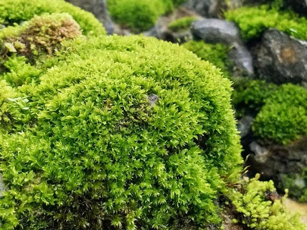

## All about mosses

Such an interesting glow can be created not only by protonemes, but also by whole thalli of those types of mosses, which are called in general terms self-luminous, or semi-precious, mosses. Such mosses are widespread in the Northern Hemisphere of our planet, and in Russia they can be found in the mountains of the Far East, Siberia, and Karelia. In Ukraine, there are especially many semi-precious mosses in the Carpathians.

The self-illumination of mosses, which has long frightened ignorant people, has valuable biological significance. This special adaptation ensures the course of photosynthesis under scattered light conditions by focusing light rays on chlorophyll grains - chloroplasts.

Here are some interesting processes that the most ancient land plants - bryophytes - can tell us.

What is the role of mosses in nature? Interestingly, mosses are not directly involved in food chains, because they are mostly not eaten by animals and are even slightly damaged by insects, bacteria and fungi. Only sometimes, as by-products, mosses can be eaten by some insects and birds (ducks) forcibly, in the absence of other food.

Mosses grow very slowly, from 1–2 mm to several centimeters per year. Perennial mosses, not damaged or eaten by animals, form powerful sods, the thickness of which, taking into account the layer of their dead parts - the formed peat - is equal to several meters. So, in the European part of Russia, peat bogs reach ten meters in places.

Scientists believe that bryophytes play a special, even global role in regulating the water balance of the continents, accumulating and retaining moisture in sods.

Mosses worsen the productivity of agricultural land, causing waterlogging. And at the same time, by transferring the surface runoff to the underground, mosses contribute to the accumulation of moisture in the soil and protect the fertile layers from erosion.

Some types of mosses have antimicrobial properties and are used for medicinal purposes. Mosses can accumulate (accumulate) many substances, for example, radioactive. Therefore, before their economic use, mosses are first checked for the presence of radioactive substances.

Moss is often used to make materials for construction (pressed slabs); they are used in agriculture as bedding in animal quarters. Peat deposits are a fuel source and are widely exploited.

You see what useful and important representatives of the plant world are bryophytes, so you need to know the features of the structure and life of different types of mosses.

Numerous species of bryophytes in terms of quantity rank second in the world of plants after flowering and are divided into three classes: Anthocerotopsida, Liverworts (Marchantiopsida), Leafy plants (Bryopsida).

